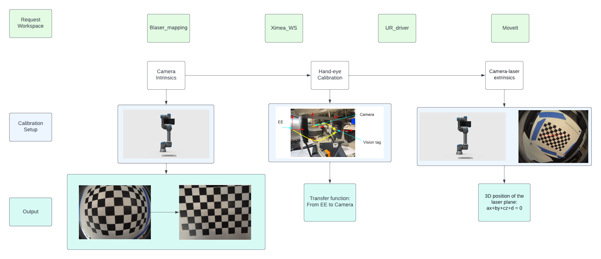

# Mutil_Calibration
This repo combine Camera Intrinsics, Hand-eye Calibration, Camera-laser extrinsics method by using Robot arm



## 0. Installation
This section is about the requested repo need to be install before the calibration.
### 0.1 Environment
This linux use Ubuntu 18.04 and ROS Melodic ([Installation](http://wiki.ros.org/melodic/Installation/Ubuntu)). ROS noetic can also work with the MEI camera model download from ([Model file](https://drive.google.com/drive/folders/1xBam90TTU8bbKEM8wfbRfDEYF7RcXm7B?usp=sharing))
### 0.2 Install dependencies Workspace
1. [blaser_ros](https://github.com/biorobotics/blaser_mapping/tree/master/blaser_ros)
2. Ximea_ws (may install with the Blaser Dependencies)
3. [Universal_Robots_ROS_Driver
](https://github.com/UniversalRobots/Universal_Robots_ROS_Driver)
4. [MoveIt Tutorials Melodic
](http://docs.ros.org/en/melodic/api/moveit_tutorials/html/index.html)
/ [MoveIt Tutorials Noetic
](https://ros-planning.github.io/moveit_tutorials/)


### 0.3 Build Calibration Workspace 

```shell
$ cd ~
$ mkdir -p ~/calibration_ws/src
$ cd ~/calibration_ws/src
$ git clone https://github.com/ros-planning/moveit_tutorials.git -b melodic-devel
$ git clone https://github.com/ros-planning/panda_moveit_config.git -b melodic-devel
$ mkdir ~/calibration_ws/src/src
$ cd ~/calibration_ws/src/src
$ git clone -b boost https://github.com/UniversalRobots/Universal_Robots_Client_Library.git src/Universal_Robots_Client_Library
$ git clone https://github.com/UniversalRobots/Universal_Robots_ROS_Driver.git src/Universal_Robots_ROS_Driver
$ git clone -b calibration_devel https://github.com/fmauch/universal_robot.git src/fmauch_universal_robot
$ sudo apt update -qq
$ rosdep update
$ rosdep install --from-paths src --ignore-src -y
$ cd ~/calibration_ws
$ catkin build
```
After build success, we clone the Mutil_Calibration repo into source file

```shell
$ cd ~/calibration_ws/src
$ git clone https://github.com/biorobotics/Mutil_Calibration.git
$ cd ~/calibration_ws
$ catkin build
```
Better catkin build several time (mostly three)

The calibration workspace should contain the following repo in the src:
* Universal_Robots_ROS_Driver
* MoveIt
* Mutil_Calibration


## 1. Camera Intrinsics
### 2.1 Hardware needed
* UR5e robot arm
* Camera holder([Example](https://drive.google.com/file/d/12sZWZGFeq9ehgpnKUAZS80BMfkZedMsY/view?usp=sharing))
## 2. Hand-eye Calibration
### 2.1 Hardware needed
* UR5e robot arm
* Camera holder([Example](https://drive.google.com/file/d/1i7l1ikb1o2ocoi0iMsCJhSHDmBsIzraE/view?usp=sharing))
* April tag holder([Example](https://drive.google.com/file/d/12sZWZGFeq9ehgpnKUAZS80BMfkZedMsY/view?usp=sharing))


## 3. Camera-laser extrinsics
### 2.1 Hardware needed
* UR5e robot arm